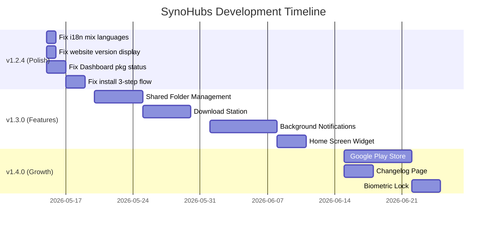

# SynoHubs — Development Roadmap v1.3.0+

> Based on full codebase audit of Mobile (Flutter), Desktop (Tauri/React), and Website (Vite/React)
> Current state: **v1.2.3** (Mobile build 10 + Desktop)

---

## 🔴 Tier 1 — Critical Fixes & Polish (v1.2.4)

> Những thứ cần sửa ngay vì ảnh hưởng trực tiếp đến trải nghiệm user.

### ~~1.1 Mobile: Dashboard `packages` status vẫn sai~~ ✅ DONE

**Vấn đề**: `dashboard_screen.dart` line 350 đọc `info.packages` từ `SessionManager`, nhưng `SessionManager.refreshData()` gọi `getPackages()` **cũ** (trước fix raw URL). Dashboard card hiển thị packages nhưng status luôn `stopped`.

**Vấn đề**: `SessionManager.refreshData()` gọi `getPackages()` mà không truyền `additional` param → packages không có status.

**Fix (DONE)**: Simplified `getPackages()` to use `_get()` with `additional` param. Confirmed URL-encoded `%5B%22status%22...%5D` IS accepted by DSM. Fixed `dname` priority in `PackageInfo` name field.

---

### 1.2 Mobile: Package Install Flow chưa hoàn chỉnh

**Vấn đề**: `_handleInstall()` trong `packages_screen.dart` gọi 3-step install nhưng chưa dùng đúng flow từ desktop:
- Step 1 thiếu `name` param (DSM cần `name="id"` JSON-quoted)  
- Step 2 polling chưa check `status == "non_installed"` → extract `filename`
- Step 3 cần `path` + `volume` thay vì chỉ `id`

**Fix**: Port chính xác 3-step flow từ desktop `lib.rs` lines 286-375 vào `_handleInstall()`.

---

### ~~1.3 Website: i18n lỗi mix ngôn ngữ~~ ✅ DONE

**Vấn đề phát hiện trong `locales.js`**:
- **Japanese** (line 690): File Manager items chứa text tiếng Bồ Đào Nha: `"Visualizações Liste & Grade"`, `"Busca em pastas"`, `"Links de compartilhamento"`
- **Japanese** (line 695): Media Hub items chứa `"Varredura de pastas"` (Bồ Đào Nha)
- **Japanese** (line 793): `whySynoHub.uniqueItems[1].desc` chứa text **tiếng Việt** 😅
- **Chinese** (line 625): `whySynoHub.uniqueItems[1].desc` cũng chứa text tiếng Việt

**Fixed**: All 22 instances corrected across JA, ZH, FR, PT locales.

---

### ~~1.4 Website: Version hiển thị cũ~~ ✅ DONE

**Vấn đề**: `download.version` trong tất cả locales vẫn hiển thị `"Version 1.0.0"` / `"Phiên bản 1.0.0"` etc.

**Fixed**: All 6 locales updated from `1.0.0` → `1.2.3`. Website deployed to Cloudflare Pages.

---

### 1.5 Desktop: Thiếu Log Center trên sidebar?

**Vấn đề**: Desktop có `LogCenter` folder trong screens nhưng cần verify nó xuất hiện trên sidebar navigation và hoạt động đúng.

---

## 🟡 Tier 2 — Feature Enhancements (v1.3.0)

> Tính năng nâng cấp trải nghiệm, tạo sự khác biệt.

### 2.1 📱 Mobile: Notifications & Background Monitoring

| Feature | Description |
|---------|------------|
| **Push notifications** | Alert khi NAS disk unhealthy, CPU >90% kéo dài, volume >95% |
| **Background service** | Periodic health check (every 15min) dùng `WorkManager` |
| **Notification channels** | System alerts, Package updates, Connection alerts |

**Tại sao**: Đây là tính năng #1 mà Synology DS Finder thiếu. Sẽ tạo competitive advantage cực lớn.

---

### 2.2 📱 Mobile: Quick Actions Widget

| Feature | Description |
|---------|------------|
| **Home screen widget** | Hiển thị CPU/RAM/Storage realtime trên Android home |
| **Quick action tiles** | Restart NAS, Start/Stop Docker containers |

---

### 2.3 🖥️ Desktop + 📱 Mobile: Shared Folder Management

| Feature | Description |
|---------|------------|
| **List shared folders** | `SYNO.Core.Share` → list all shares |
| **Permission editing** | Set user/group permissions per folder |
| **Create/Delete shares** | Full CRUD for shared folders |

**API**: `SYNO.Core.Share` (version 1, methods: `list`, `create`, `set`, `delete`)

---

### 2.4 📱 Mobile: Download Station Integration

| Feature | Description |
|---------|------------|
| **Task list** | View active/completed/paused downloads |
| **Add download** | URL, magnet link, or torrent file |
| **Control** | Pause, resume, delete tasks |

**API**: `SYNO.DownloadStation2.Task` (version 2)

---

### 2.5 🖥️ Desktop + 📱 Mobile: Backup & Restore (Hyper Backup)

| Feature | Description |
|---------|------------|
| **Task overview** | List all Hyper Backup tasks + last run status |
| **Trigger backup** | Start a backup task manually |
| **History** | View backup versions/timeline |

**API**: `SYNO.Backup.Task` (version 1)

---

### 2.6 🖥️ Desktop: Real-time Network Monitor

| Feature | Description |
|---------|------------|
| **Bandwidth chart** | Live upload/download bandwidth (like desktop Resource Monitor but enhanced) |
| **Per-interface stats** | LAN1, LAN2, Bond etc. |

---

## 🟢 Tier 3 — Strategic Growth (v1.4.0+)

> Chiến lược dài hạn để tăng user base và monetize.

### 3.1 🌐 Website: Changelog / Release Notes Page

- Auto-generate từ GitHub releases API  
- Hiển thị version history, download links, release notes  
- SEO-optimized cho "Synology NAS manager app"  

---

### 3.2 📱 Google Play Store Deployment

| Step | Detail |
|------|--------|
| Developer account | $25 one-time Google fee |
| App signing | Google Play App Signing setup |
| Store listing | Screenshots, description, privacy policy |
| AAB build | `flutter build appbundle --release` thay vì APK |
| In-app purchase | Thay PayPal flow bằng Google Play Billing cho VIP |

**Impact**: 10x reach so với chỉ APK sideload.

---

### 3.3 🍎 iOS App

- Flutter đã cross-platform → chỉ cần iOS-specific setup  
- Apple Developer Program: $99/year  
- Cần adapt cho iOS Human Interface Guidelines  
- App Store review thường 1-3 ngày  

---

### 3.4 📱 Mobile: Biometric Lock

| Feature | Description |
|---------|------------|
| **App lock** | Fingerprint / Face ID to unlock app |
| **Per-profile lock** | Optional biometric per NAS profile |
| **Auto-lock timeout** | Lock after X minutes inactive |

**Package**: `local_auth` (Flutter)

---

### 3.5 📱 Mobile: Offline Mode & Caching

| Feature | Description |
|---------|------------|
| **Dashboard cache** | Show last-known NAS state when offline |
| **File favorites** | Pin files for offline access |
| **Photo cache** | Thumbnail cache for faster browsing |

---

### 3.6 🎨 Desktop: Theme System

- Light mode (currently dark only?)
- Custom accent colors  
- Follow system theme preference  

---

## 🔧 Technical Debt

> Code quality items phát hiện trong audit.

### TD-1: `synology_api.dart` quá lớn (40KB, 1269 lines)

**Recommendation**: Tách thành modules:
```
services/
  synology_api.dart          → core HTTP + auth
  api/
    packages_api.dart        → Package-related methods
    docker_api.dart          → Docker methods  
    files_api.dart           → FileStation methods
    photos_api.dart          → Photos methods
    system_api.dart          → System info, logs, users
```

### TD-2: Hardcoded strings trong mobile screens

Nhiều screen (Docker, Packages) vẫn dùng hardcoded English strings thay vì `AppLocalizations`. Ví dụ:
- `docker_screen.dart`: `"Docker Not Available"`, `"Running"`, `"Stopped"`
- `packages_screen.dart`: `"Installed"`, `"Install"`, `"Uninstall"` etc.

### TD-3: Error handling không consistent

Một số API calls catch `Exception` nhưng không show user-friendly message. Cần:
- Centralized error handler  
- Map Synology error codes → readable messages  
- Timeout handling (NAS unreachable vs API error)

### TD-4: Dashboard `SessionManager` gọi API v1 (không có status)

`SessionManager.refreshData()` gọi `getPackages()` nhưng **trước đây** dùng `_get()` với URL-encoded params → packages trong `NasInfo` không có status đúng. Cần verify `SessionManager` dùng method `getPackages()` đã fix (raw URL).

### TD-5: Missing `flutter_lints` / analysis_options.yaml review

Cần chạy `flutter analyze` và fix tất cả warnings để code quality đồng đều.

---

## 📋 Recommended Priority Order



---

## 💡 Đề xuất ngay bây giờ

Nếu muốn làm ngay trong session này, tôi recommend theo thứ tự:

1. **Fix i18n lỗi mix ngôn ngữ** (15 phút) → impact lớn, effort thấp
2. **Fix website version `1.0.0` → `1.2.3`** (5 phút)
3. **Fix Dashboard package status** (30 phút) → `SessionManager` cần dùng raw URL getPackages
4. **Fix Package install 3-step flow** (45 phút) → port exact logic từ desktop

Bạn muốn bắt đầu từ đâu? 🚀
